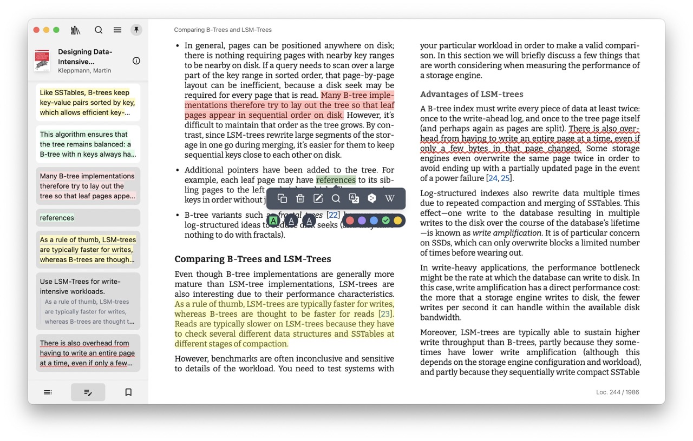
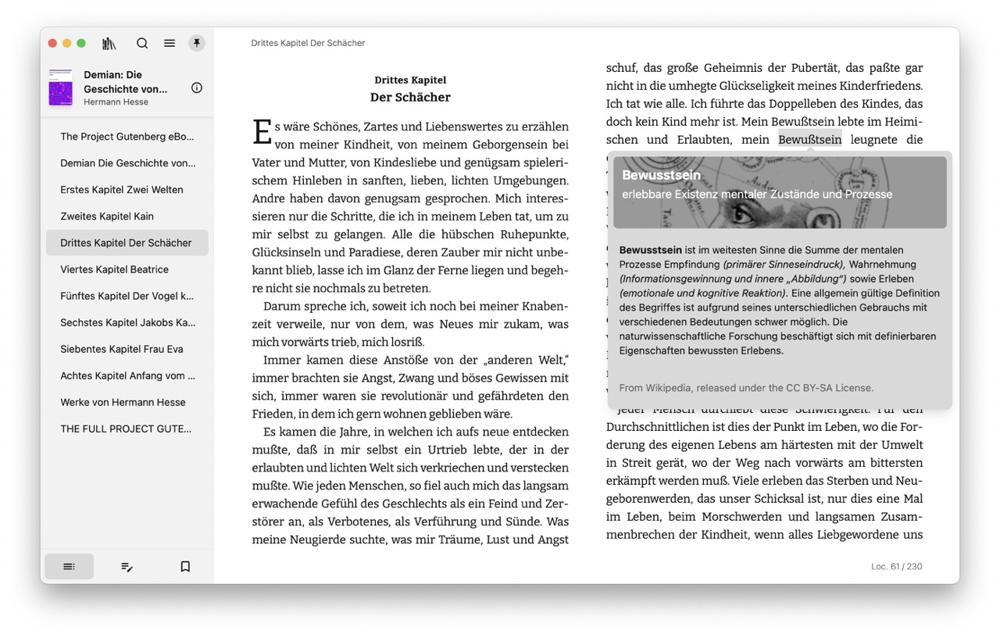
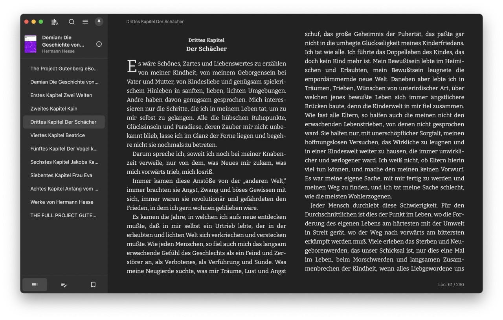

# Readest 📚

<div align="center">
<div align="center">
  
</div>
<br/>
Readest is an open-source ebook reader designed for immersive and deep reading experiences. Built as a modern rewrite of [Foliate](https://github.com/johnfactotum/foliate), it leverages [Next.js](https://github.com/vercel/next.js) and [Tauri v2](https://github.com/tauri-apps/tauri) to offer a seamless cross-platform experience on macOS, Windows, Linux, with support for mobile platforms coming soon.
</div>

## Features

- **EPUB and PDF Support**: Enjoy both EPUB and PDF formats (experimental), making Readest versatile for all your reading needs.
- **Cross-Platform Compatibility**: Runs on macOS, Windows, Linux and iOS, Android (coming soon) with Tauri v2.
- **Immersive Reading Experience**: Supports advanced reading features like note-taking, highlighting, full-text search and [Parallel Read](https://readest.com/#parallel-read).
- **Customizable Interface**: Built with daisyUI for a modern and user-friendly UI.

## Screenshots








---

## Requirements

- **Node.js** and **pnpm** for Next.js development
- **Rust and Cargo** for Tauri development

For the best experience, use a recent version of Node.js and Rust. Refer to the [Tauri documentation](https://v2.tauri.app/start/prerequisites/) for details on setting up the development environment prerequisites on different platforms.

```bash
nvm install v22
nvm use v22
rustup update
```

## Getting Started

To get started with Readest, follow these steps to clone and build the project.

### 1. Clone the Repository

```bash
git clone https://github.com/chrox/readest.git
cd readest
git submodule update --init --recursive
```

### 2. Install Dependencies

```bash
npm install -g pnpm
pnpm install
# copy pdfjs-dist to Next.js public directory
pnpm --filter @readest/readest-app setup-pdfjs
```

### 3. Verify Dependencies Installation

To confirm that all dependencies are correctly installed, run the following command:

```bash
pnpm tauri info
```

This command will display information about the installed Tauri dependencies and configuration on your platform. Note that the output may vary depending on the operating system and environment setup. Please review the output specific to your platform for any potential issues.

For Windows targets, “Build Tools for Visual Studio 2022” (or a higher edition of Visual Studio) and the “Desktop development with C++” workflow must be installed. For Windows ARM64 targets, the “VS 2022 C++ ARM64 build tools” and "C++ Clang Compiler for Windows" components must be installed. And make sure `clang` can be found in the path by adding `C:\Program Files (x86)\Microsoft Visual Studio\2022\BuildTools\VC\Tools\Llvm\x64\bin` for example in the environment variable `Path`.

### 4. Build the Development

```bash
pnpm tauri dev
```

### 5. Build for Production

```bash
pnpm tauri build
```

## Contributing

Readest is open-source, and contributions are welcome! Feel free to open issues, suggest features, or submit pull requests. Please review our contributing guidelines before you start.

## License

Readest is distributed under the AGPL-3.0 License. See the [LICENSE](<(LICENSE)>) file for details.

---

Happy reading with Readest!
