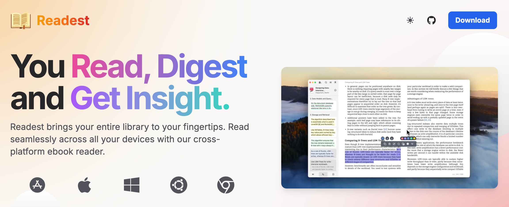
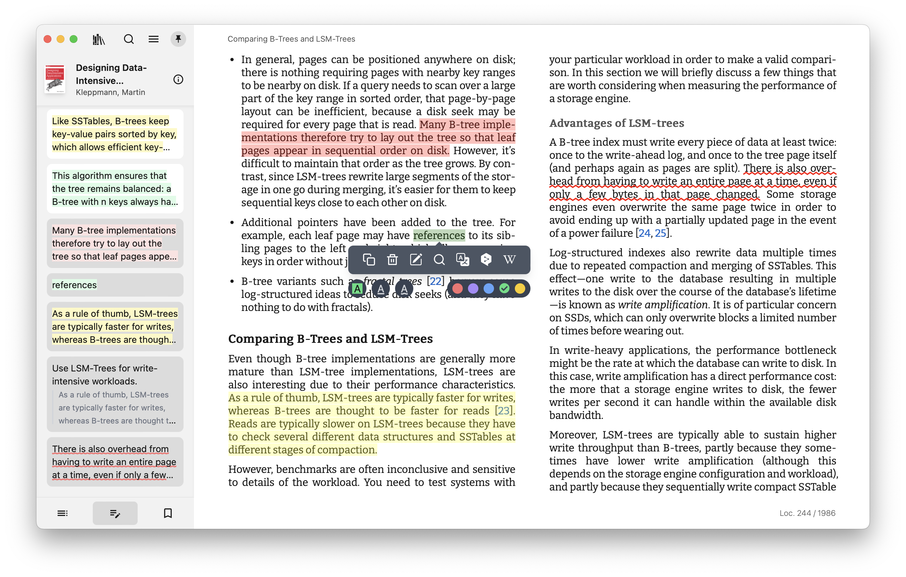
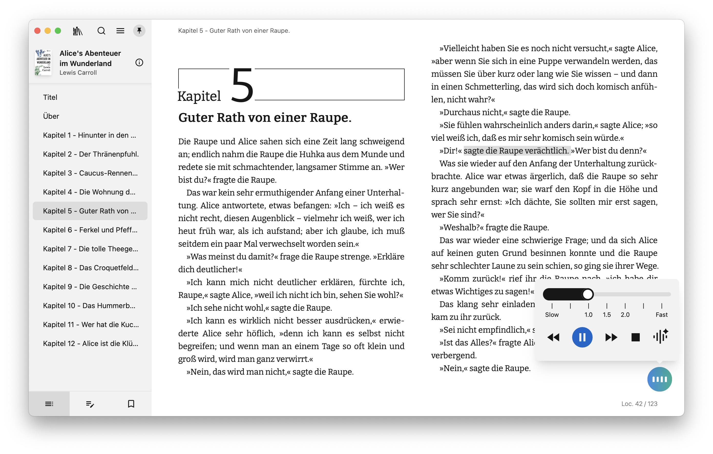
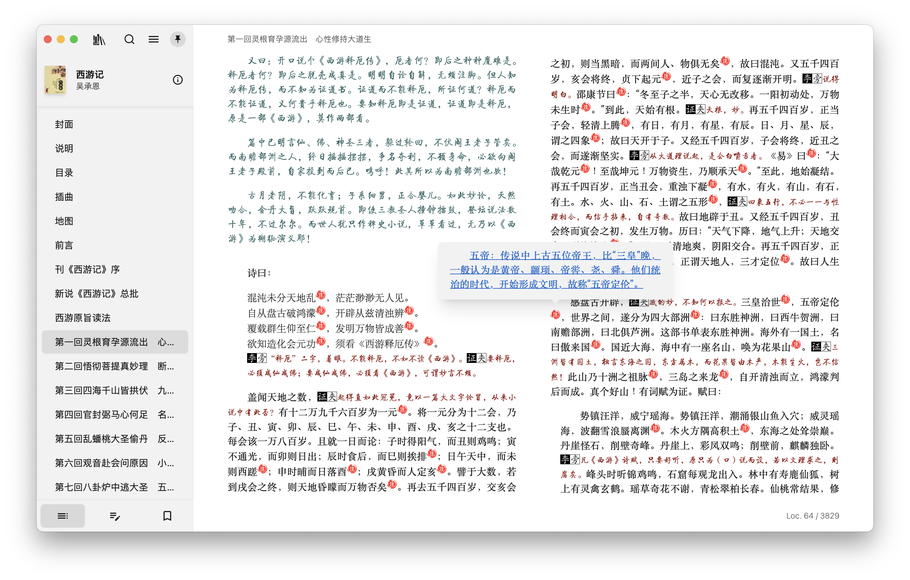
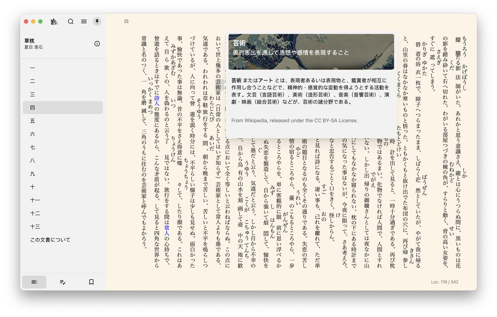
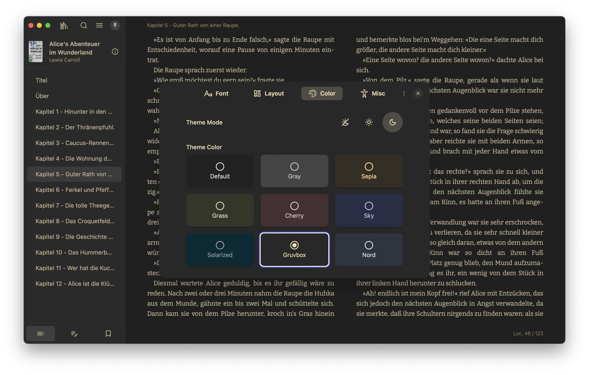

<div align="center">
  <a href="https://readest.com?utm_source=github&utm_medium=referral&utm_campaign=readme" target="_blank">
    
  </a>
  <h1>Readest</h1>
  <br>

[Readest][link-website] is an open-source ebook reader designed for immersive and deep reading experiences. Built as a modern rewrite of [Foliate](https://github.com/johnfactotum/foliate), it leverages [Next.js 15](https://github.com/vercel/next.js) and [Tauri v2](https://github.com/tauri-apps/tauri) to offer a seamless cross-platform experience on macOS, Windows, Linux and Web, with support for mobile platforms coming soon.

[![Website][badge-website]][link-website]
[![Web App][badge-web-app]][link-web-readest]
[![OS][badge-platforms]][link-website]
[![][badge-discord]][link-discord]
<br>
[![AGPL Licence][badge-license]](LICENSE)
[![Latest release][badge-release]][link-gh-releases]
[![Last commit][badge-last-commit]][link-gh-commits]
[![Commits][badge-commit-activity]][link-gh-pulse]

</div>

<p align="center">
  <a href="#features">Features</a> •
  <a href="#planned-features">Planned Features</a> •
  <a href="#screenshots">Screenshots</a> •
  <a href="#downloads">Downloads</a> •
  <a href="#getting-started">Getting Started</a> •
  <a href="#contributors">Contributors</a> •
  <a href="#license">License</a>
</p>

<div align="center">
  <a href="https://readest.com" target="_blank">
    
  </a>
</div>

## Features

<div align="left">✅ Implemented</div>

| **Feature**                             | **Description**                                                                    | **Status** |
| --------------------------------------- | ---------------------------------------------------------------------------------- | ---------- |
| **Multi-Format Support**                | Support EPUB, MOBI, KF8 (AZW3), FB2, CBZ, PDF (experimental)                       | ✅         |
| **Scroll/Page View Modes**              | Switch between scrolling or paginated reading modes.                               | ✅         |
| **Full-Text Search**                    | Search across the entire book to find relevant sections.                           | ✅         |
| **Annotations and Highlighting**        | Add highlights, bookmarks, and notes to enhance your reading experience.           | ✅         |
| **Excerpt Text for Note-Taking**        | Easily excerpt text from books for detailed notes and analysis.                    | ✅         |
| **Dictionary/Wikipedia Lookup**         | Instantly look up words and terms when reading.                                    | ✅         |
| **Translate with DeepL**                | Translate selected text instantly using DeepL for accurate translations.           | ✅         |
| **[Parallel Read][link-parallel-read]** | Read two books or documents simultaneously in a split-screen view.                 | ✅         |
| **Customize Font and Layout**           | Adjust font, layout, theme mode, and theme colors for a personalized experience.   | ✅         |
| **File Association and Open With**      | Quickly open files in Readest in your file browser with one-click.                 | ✅         |
| **Sync across Platforms**               | Synchronize reading progress, notes, and bookmarks across all supported platforms. | ✅         |
| **Text-to-Speech (TTS) Support**        | Enable text-to-speech functionality for a more accessible reading experience.      | ✅         |

## Planned Features

<div align="left">🛠 Building</div>
<div align="left">🔄 Planned</div>

| **Feature**                     | **Description**                                                                            | **Priority** |
| ------------------------------- | ------------------------------------------------------------------------------------------ | ------------ |
| **Support iOS and Android**     | Expand the APP to work on iOS and Android devices.                                         | 🛠           |
| **Library Management**          | Organize, sort, and manage your entire ebook library.                                      | 🛠           |
| **AI-Powered Summarization**    | Generate summaries of books or chapters using AI for quick insights.                       | 🔄           |
| **Sync with Koreader**          | Synchronize reading progress, notes, and bookmarks with [Koreader][link-koreader] devices. | 🔄           |
| **Keyboard Navigation**         | Implement vimium-style keybindings for book navigation.                                    | 🔄           |
| **Support OPDS/Calibre**        | Integrate OPDS/Calibre to access online libraries and catalogs.                            | 🔄           |
| **Audiobook Support**           | Extend functionality to play and manage audiobooks.                                        | 🔄           |
| **Handwriting Annotations**     | Add support for handwriting annotations using a pen on compatible devices.                 | 🔄           |
| **Advanced Reading Stats**      | Track reading time, pages read, and more for detailed insights.                            | 🔄           |
| **In-Library Full-Text Search** | Search across your entire ebook library to find topics and quotes.                         | 🔄           |

Stay tuned for continuous improvements and updates! Contributions and suggestions are always welcome—let's build the ultimate reading experience together. 😊

## Screenshots












---

## Downloads

The Readest app is available for download! 🥳 🚀

- macOS : Search for "Readest" on the [macOS App Store][link-macos-appstore].
- Windows / Linux: Visit [https://readest.com][link-website] or the [Releases on GitHub][link-gh-releases].
- Web: Visit [https://web.readest.com][link-web-readest].
- iOS / Android: coming soon 👀

## Requirements

- **Node.js** and **pnpm** for Next.js development
- **Rust** and **Cargo** for Tauri development

For the best experience to build Readest for yourself, use a recent version of Node.js and Rust. Refer to the [Tauri documentation](https://v2.tauri.app/start/prerequisites/) for details on setting up the development environment prerequisites on different platforms.

```bash
nvm install v22
nvm use v22
npm install -g pnpm
rustup update
```

## Getting Started

To get started with Readest, follow these steps to clone and build the project.

### 1. Clone the Repository

```bash
git clone https://github.com/readest/readest.git
cd readest
git submodule update --init --recursive
```

### 2. Install Dependencies

```bash
# might need to rerun this when code is updated
pnpm install
# copy pdfjs-dist to Next.js public directory
pnpm --filter @readest/readest-app setup-pdfjs
```

### 3. Verify Dependencies Installation

To confirm that all dependencies are correctly installed, run the following command:

```bash
pnpm tauri info
```

This command will display information about the installed Tauri dependencies and configuration on your platform. Note that the output may vary depending on the operating system and environment setup. Please review the output specific to your platform for any potential issues.

For Windows targets, “Build Tools for Visual Studio 2022” (or a higher edition of Visual Studio) and the “Desktop development with C++” workflow must be installed. For Windows ARM64 targets, the “VS 2022 C++ ARM64 build tools” and "C++ Clang Compiler for Windows" components must be installed. And make sure `clang` can be found in the path by adding `C:\Program Files (x86)\Microsoft Visual Studio\2022\BuildTools\VC\Tools\Llvm\x64\bin` for example in the environment variable `Path`.

### 4. Build for Development

```bash
pnpm tauri dev
```

For iOS:

```bash
pnpm tauri ios dev
```

### 5. Build for Production

```bash
pnpm tauri build
```

### 6. Setup dev environment with Nix

If you have Nix installed, you can leverage flake to enter a development shell
with all the necessary dependencies:

```bash
nix develop ./ops  # enter a dev shell for the web app
nix develop ./ops#ios # enter a dev shell for the ios app
nix develop ./ops#android # enter a dev shell for the android app
```

### 7. More information

Please check the [wiki][link-gh-wiki] of this project for more information on development.

## Contributors

Readest is open-source, and contributions are welcome! Feel free to open issues, suggest features, or submit pull requests. Please **review our [contributing guidelines](CONTRIBUTING.md) before you start**. We also welcome you to join our [Discord][link-discord] community for either support or contributing guidance.

<a href="https://github.com/readest/readest/graphs/contributors">
  <p align="left">
    
  </p>
</a>

## License

Readest is free software: you can redistribute it and/or modify it under the terms of the [GNU Affero General Public License](https://www.gnu.org/licenses/agpl-3.0.html) as published by the Free Software Foundation, either version 3 of the License, or (at your option) any later version. See the [LICENSE](LICENSE) file for details.

The following libraries and software are used in this software:

- [foliate-js](https://github.com/johnfactotum/foliate-js), which is MIT licensed.
- [zip.js](https://github.com/gildas-lormeau/zip.js), which is licensed under the BSD-3-Clause license.
- [fflate](https://github.com/101arrowz/fflate), which is MIT licensed.
- [PDF.js](https://github.com/mozilla/pdf.js), which is licensed under Apache License 2.0.
- [next.js](https://github.com/vercel/next.js), which is MIT licensed.
- [react](https://github.com/facebook/react), which is MIT licensed.
- [react-icons](https://github.com/react-icons/react-icons), which has various open-source licenses.
- [tauri](https://github.com/tauri-apps/tauri), which is MIT licensed.

The following fonts are utilized in this software, either bundled within the application or provided through web fonts:

[Bitter](https://fonts.google.com/?query=Bitter), [Fira Code](https://fonts.google.com/?query=Fira+Code), [Literata](https://fonts.google.com/?query=Literata), [Merriweather](https://fonts.google.com/?query=Merriweather), [Noto Sans](https://fonts.google.com/?query=Noto+Sans), [Roboto](https://fonts.google.com/?query=Roboto), [LXGW WenKai](https://github.com/lxgw/LxgwWenKai), [MiSans](https://hyperos.mi.com/font/en/), [Source Han](https://github.com/adobe-fonts/source-han-sans/), [WenQuanYi Micro Hei](http://wenq.org/wqy2/)

---

<div align="center" style="color: gray;">Happy reading with Readest!</div>

[badge-website]: https://img.shields.io/badge/website-readest.com-orange
[badge-web-app]: https://img.shields.io/badge/read%20online-web.readest.com-orange
[badge-license]: https://img.shields.io/github/license/readest/readest?color=teal
[badge-release]: https://img.shields.io/github/release/readest/readest?color=green
[badge-platforms]: https://img.shields.io/badge/OS-macOS%2C%20Windows%2C%20Linux%2C%20Web-green
[badge-last-commit]: https://img.shields.io/github/last-commit/readest/readest?color=green
[badge-commit-activity]: https://img.shields.io/github/commit-activity/m/readest/readest
[badge-discord]: https://img.shields.io/discord/1314226120886976544?color=5865F2&label=discord&labelColor=black&logo=discord&logoColor=white&style=flat-square
[link-macos-appstore]: https://apps.apple.com/app/apple-store/id6738622779?pt=127463130&ct=github&mt=8
[link-website]: https://readest.com?utm_source=github&utm_medium=referral&utm_campaign=readme
[link-web-readest]: https://web.readest.com
[link-gh-releases]: https://github.com/readest/readest/releases
[link-gh-commits]: https://github.com/readest/readest/commits/main
[link-gh-pulse]: https://github.com/readest/readest/pulse
[link-gh-wiki]: https://github.com/readest/readest/wiki
[link-discord]: https://discord.gg/gntyVNk3BJ
[link-parallel-read]: https://readest.com/#parallel-read
[link-koreader]: https://github.com/koreader/koreader
